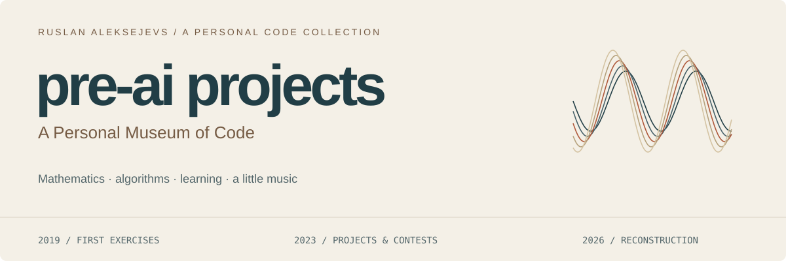
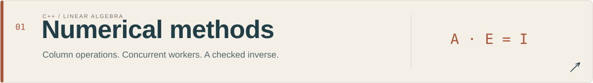
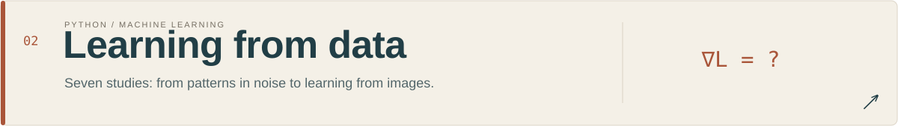
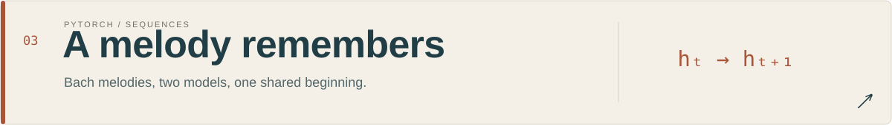
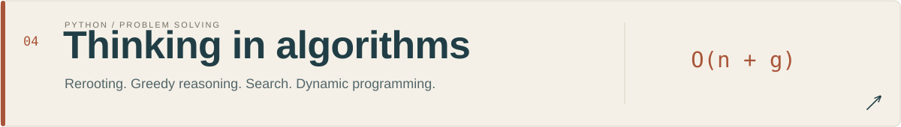
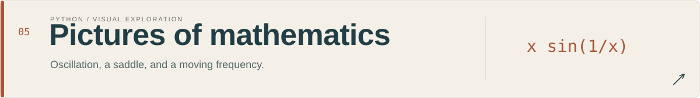
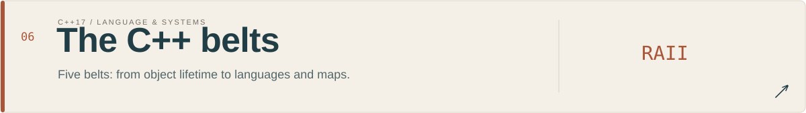

<a href="#six-places-to-start">Six places to start</a> · <a href="projects/machine-learning/random-correlations/README.md">Random correlations</a> · <a href="#the-collection">Full collection</a> · <a href="originals/README.md">My handwritten code</a> · <a href="docs/timeline.md">Follow the timeline</a> · <a href="docs/marginalia.md">Read the marginalia</a> · <a href="docs/reproduce.md">Run the work</a> · <a href="docs/ru.md">По-русски</a>

Welcome to my **personal museum of code**.

Most of the code I wrote never made it to GitHub. This museum brings together a small selection of surviving pieces from my time studying Math at MSU: coursework, summer schools, experiments, and programming contests. There is more among the material I already have, and on old laptops and flash drives. I will probably never add anything else to this museum.

**The text and modern code in this museum were created by Codex, with a smaller contribution from Claude Code, under my supervision.** The historical quotations and handwritten code are preserved from the originals.

For me, this is also an **experiment in AI capabilities**: how far can these tools take a collection of old projects through reconstruction, testing and presentation?

**Looking for code I actually wrote by hand? Start with [the originals](originals/README.md).** It links unchanged serial, pthreads and MPI routines, a complete tree-rerooting solution, my old CNN class and the random-correlation experiment to their modern counterparts. The `originals/` directory is the historical layer; the code under `projects/` is the 2026 reconstruction.

## Six places to start

| Exhibit | My handwritten source | The 2026 reconstruction by Codex |
| :-- | :-- | :-- |
| **[Random correlations: patterns from pure noise](projects/machine-learning/random-correlations/README.md)** | [My original notebook cells, plots and reaction](originals/learning/random-correlations.ipynb), unchanged | Search almost 12.5 million pairs: **0.901** on discovery data becomes **−0.057** on untouched data. A lesson in checking apparent discoveries. |
| **Parallel matrix inversion** | [My MPI solver](originals/numerics/mpi-solver.cpp), unchanged | [Serial, threads and MPI on the same matrices](projects/numerical-methods/comparison/README.md): where parallelism helps and where it costs more. |
| **A small CNN, revisited** | [My original network class](originals/learning/convnet.py), unchanged | [The old architecture beside a new CNN](projects/machine-learning/cnn/README.md), with matched training and visible mistakes. |
| **A melody remembers** | The school and our final team project are the historical exhibit; old team code is not reproduced. | [Listen to GRU and Markov continuations](projects/music-generation/README.md#listen) of the same Bach prompts. |
| **Tree rerooting** | [My complete contest solution](originals/algorithms/root-count.py), unchanged | [An iterative version and independent checks](projects/algorithms/README.md#two-useful-invariants), including a deep tree. |
| **From C++ exercises to small systems** | My old submissions have not been recovered. | [Mython, a spreadsheet and transit routing](projects/cpp-belts/course/black/README.md): new solutions, with reconstructed interfaces labelled. |

## Why keep a museum?

I have looked through this repository once. This is a museum, and I do not plan to actively maintain it.

I am glad that at least these fragments survived as memories. They already deserve a little museum of their own.

Around the code I left notes to my future self: improve this, finish that, explain the idea, make the repository look decent. I never quite found the energy or the desire to do all of it. The files gathered dust until I decided to revisit them with Codex.

This is my tribute to those dark ages when we wrote code by hand, got stuck, and sometimes waited days on Stack Overflow for a human to help. I still occasionally feel nostalgic about those MPI discussions: a stubborn parallel program, a question, and the relief of finally understanding what went wrong.

The museum keeps selected original fragments, comments, and stories. Its modern exhibits develop those ideas into readable implementations and reproducible experiments, rebuilt with Codex in 2026. “Pre-AI” describes how I worked then; the restoration uses the tools I have now.

## The collection

Each card opens a self-contained chapter: the problem, its origins, the implementation, and evidence that you can inspect.

## A few things to inspect

| Question | Evidence |
| :-- | :-- |
| Does the inverse agree with an independent implementation? | [75 comparisons with NumPy/LAPACK](projects/numerical-methods/results/verification.json), maximum absolute difference **4.44 × 10⁻¹⁶**. |
| Does the distributed inverse agree too? | [75 MPI comparisons across 1–6 processes](projects/numerical-methods/mpi/results/verification.json), maximum relative entrywise difference **2.95 × 10⁻¹⁶**; collective failure tests included. |
| When does parallelism pay off? | [120 measurements on identical matrices](projects/numerical-methods/comparison/README.md): at 512×512, four threads give **2.31×** versus serial and four MPI ranks give **3.43×** versus one MPI rank; small problems lose to overhead. |
| Can pure noise produce a convincing pattern? | [Yes, if we search enough pairs](projects/machine-learning/random-correlations/README.md): **0.901** on discovery data, **−0.057** on the untouched half. |
| Does the implemented gradient match the derivative of its loss? | [Finite-difference check](projects/machine-learning/results/metrics.json), maximum error **2.75 × 10⁻¹⁰**; **96%** accuracy on 450 held-out digits. |
| What does my unchanged old CNN learn today? | [A matched CIFAR-10 experiment](projects/machine-learning/cnn/README.md): **53.2%** test accuracy for the historical architecture and **70.6%** for a new compact CNN, averaged over three seeds; curves and errors included. |
| Can spatial context identify car parts? | [Real course annotations](projects/machine-learning/segmentation/README.md): U-Net mean IoU **.639**, versus **.158** for a color-only model. |
| Does a fitted model always beat a simple rule? | [In demand forecasting, no](projects/machine-learning/forecasting/README.md): the four-week average has lower MAE than ridge. |
| What do the five C++ belts build toward? | [A router, maps, Mython and a spreadsheet](projects/cpp-belts/course/README.md), with local checks linked to all **189 recovered pages** and adaptations marked explicitly. |
| Does a recurrent network beat a simpler model? | [On unseen Bach melodies, yes](projects/music-generation/README.md#what-happened): event NLL **2.051 ± 0.026** across three GRU runs, versus **2.416** for Markov. |
| Does rerooting survive a deep tree? | [Independent oracles and a 10,001-vertex chain](tests/test_algorithms.py). |
| Can an index change while readers keep searching? | [40,000 concurrent queries and a deliberately blocked writer](projects/cpp-belts/tests/check.cpp); 124,000 oracle comparisons across the search and domain exhibits. |

These are measured results from small, explicitly bounded experiments. They are not claims of production readiness or broad model superiority.

## Notes from the margins

> Нда, нужно было писать комменты тогда, зря торопился

My old music-project README: “Yeah, I should have written comments back then. Shouldn't have rushed.”

> Нельзя давать такую хуету в качестве Q1.

My reaction to the opening problem of Biweekly Contest 100: “You can't give this shit as Q1.”

[More original comments, with their sources →](docs/marginalia.md)

## How to explore the collection

**Then** is the surviving source and its context. **Now** is the reconstruction. **Evidence** is executable verification and recorded results. Every chapter keeps those three layers visible.

The [origin ledger](docs/origins.md) records sources and selected excerpts. [Course notes](docs/courses.md) reconnect the ML work to its teaching context. Original repositories stay separate and private; the chapter text is understandable without access to them. Old commit dates remain old, new work receives new dates.

This is the first museum edition. The serial/threaded numerical study and its [restored MPI branch](projects/numerical-methods/mpi/README.md), selected algorithms, C++ exhibits and plotting gallery run locally. The music chapter now compares a GRU and Markov model on unseen Bach chorale families, with matched listening examples. See [current scope](docs/scope.md).

---

[Start with the numerical methods →](projects/numerical-methods/README.md) · [Reproduce everything](docs/reproduce.md)

[MIT license](LICENSE). Existing third-party data and model notices remain with their respective materials.
