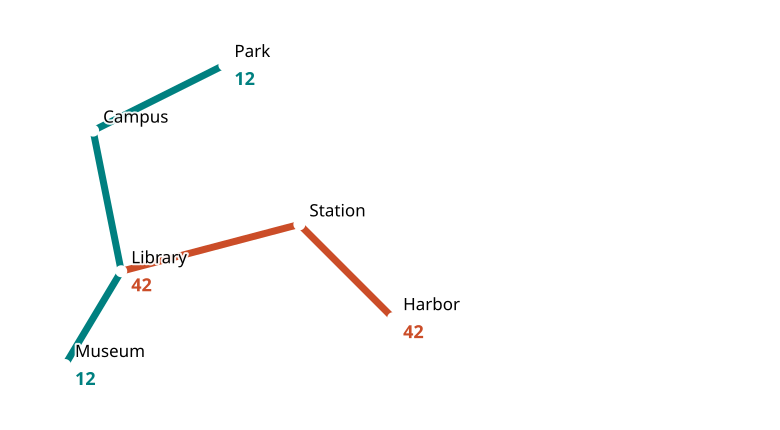

[← Five belts](../README.md) · [Exact coverage](coverage.json) · [Mython](README-mython.md)

# Black Belt: ownership, languages and maps

Twenty-four recovered task pages lead to these new C++17 implementations. Codex wrote this reconstruction in 2026; none of it is presented as my old handwritten submission.



## Complete programs

```sh
python3 projects/cpp-belts/course/black/check.py --build /tmp/museum-black
/tmp/museum-black/black transport G < projects/cpp-belts/course/black/examples/transport.json
python3 projects/cpp-belts/course/black/check_mython.py
```

[Example input](examples/transport.json) · [Computed route](examples/route.json) · [Compressed map](examples/map-k.svg).

**Transport E–K.** [Routing](transport.hpp) uses ground nodes for stops and onboard nodes for route occurrences. Boarding costs waiting time; riding costs road distance divided by speed. The graph is linear in total route length; Dijkstra answers one query in `O((V + E) log V)`. Forward/reverse routes are separate, so turning around requires boarding again. Directional distances, transfers, unreachable stops and repeated names are checked against an independent dense Floyd–Warshall oracle.

The [SVG library](svg.hpp) escapes XML. Modes `G/H/I` use geographic projection; `H` adds bus labels, `I` supports explicit layer order/repetition. `J` uses coordinate ranks; `K` merges adjacent groups unless a route segment connects them. Standalone maps have explicit viewport dimensions to avoid viewer cropping. The JSON wrapper includes request IDs for maps as well as routes.

**Spreadsheet.** [The sparse engine](spreadsheet.hpp) supports text, apostrophe escaping, unary/binary arithmetic, references and `#REF!`, `#VALUE!`, `#DIV/0!`. Iterative parsing/evaluation avoids native recursion on long dependency chains. Reverse dependencies invalidate affected caches. Cycles and malformed formulas are rejected before replacing cells. Structural edits build a temporary sheet, move cells and rewrite references transactionally. The statement's inconsistent insertion table is interpreted according to its prose: references follow the same logical cell.

`Sheet`/`Cell` and the JSON-script CLI are our local interface; the complete historical `common.h` was not recovered. Formula whitespace is normalized, parentheses retained. Structural edits invalidate cached values and pointers to old cells. Ordinary `SetCell` does not promise a strong exception guarantee on allocation failure. This is a formula engine, not an Excel file reader or GUI.

```sh
echo '[{"op":"set","cell":"A1","text":"42"},{"op":"set","cell":"B1","text":"=A1*2"},{"op":"get","cell":"B1"}]' | /tmp/museum-black/black sheet
```

**Mython.** [The interpreter chapter](README-mython.md) explains the lexer, grammar, classes, errors and tests, including the recovered GCD program.

## Smaller contracts

| Exercise | Implementation and boundary |
| :-- | :-- |
| Checked sum and variadic templates | [foundations.hpp](foundations.hpp): bounds before arithmetic; ordered application |
| Optional, Vector 1/2 | [foundations.hpp](foundations.hpp): raw storage, object lifetime, alias-safe growth and exception cleanup |
| Nucleotide packing | [foundations.hpp](foundations.hpp): masks/shifts into 64 bits with range checks |
| JSON printer | [json_printer.hpp](json_printer.hpp): types reject invalid chains; automatic closure; stream flags cannot corrupt JSON |
| Save & Load | [foundations.hpp](foundations.hpp): recursive containers and checked reads; **native layout and `size_t`, same ABI only** |
| Phone book | [phone_book.hpp](phone_book.hpp): stable sorting, logarithmic prefix boundaries and compatible [protobuf bytes](contact.proto) |
| Yellow Pages | [yellow_pages.hpp](yellow_pages.hpp): best priority per attribute and deduplicated repeated values; **JSON replaces generated protobuf accessors** |
| Three sanitizer exercises | Shared [domains](../../domains/domains.hpp), [budget](../brown/budget.hpp), [transport](../brown/transport.hpp); **not repairs of missing buggy starters** |

`Vector` doubles capacity and copies during growth if moving may throw. Move-only throwing types cannot receive that same strong guarantee. Middle insertion needs assignment and gives a basic guarantee if assignment throws; append only needs construction. These are course-scale containers, not complete standard-library replacements.

The phone-book decoder supports protobuf wire types 0/1/2/5, skips unknown fields of those types and caps input at 64 MiB. Deprecated groups are rejected. This is a schema-specific reader. The organization merger uses JSON equality; absent/default proto3 field equivalence is not emulated.

## Evidence

[C++ checks](tests.cpp): lifetime/exception cases, **15,000 vector operations**, **10,000 packed records**, **400 routing graphs**, **16,384 cell indices**, **6,000-cell chains**, **1,500 formula oracles**, and **4,800 random rewrites, clears and row/column edits** whose cached values must match a sheet rebuilt from the resulting texts. [CLI checks](test_cli.py): independent XML parsing, layer order, structural edits, protobuf golden/malformed inputs. A valid JSON chain must compile and four invalid chains must fail compilation.

```sh
python3 projects/cpp-belts/course/black/check.py --sanitize
# Optional independent runtime check, with Python protobuf installed:
python3 projects/cpp-belts/course/black/check.py --protobuf
```

The optional test uses official Python protobuf in both directions (recorded: 7.36.2); no C++ runtime or `protoc` is required. Original grader packaging, course timing limits and fresh-environment reproducibility remain unverified.
