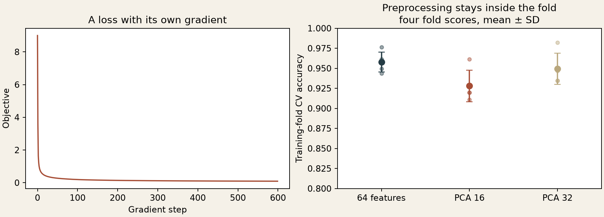

[← Collection](../../README.md) · [Previous: numerical methods](../numerical-methods/README.md) · [Next: music →](../music-generation/README.md)

# 02 / A gradient should mean what its loss says

*A compact learning experiment rebuilt from linear-model and feature-engineering notebooks.*

Seven studies revisit the surviving notebooks. My old CNN and random-correlation experiment sit beside modern counterparts; the other implementations were written afresh by Codex. Each experiment names its data, split, baseline and limitations.

| Study | What to inspect |
| :-- | :-- |
| [Random correlations: patterns from pure noise](random-correlations/README.md) | A striking correlation selected from millions of pairs disappears on untouched data |
| [Linear models](#now) | A loss/gradient mismatch, finite differences and training-only PCA |
| [Convolutional networks](cnn/README.md) | My handwritten architecture, a compact new network and three matched seeds |
| [Car segmentation](segmentation/README.md) | Real course annotations; spatial context versus a color-only baseline |
| [Transfer learning](transfer/README.md) | Frozen pretrained features versus random features and raw pixels |
| [Autoencoders](autoencoder/README.md) | Two bottleneck sizes, PCA and visible reconstruction errors |
| [Demand forecasting](forecasting/README.md) | A time-ordered experiment in which a simple baseline wins on MAE |

**MSU coursework and neural-network study.** I kept these notebooks as a working shelf of techniques to reuse in later projects. The original README groups material under `NN4science`, “Introduction to Deep Learning,” a neural-networks summer school in **August 2022**, and “Practical ML,” whose final project used Delivery Club data. The linear-model study follows below; the linked chapters develop the other threads. [Historical map](../../docs/timeline.md) · [Courses and recovered materials](../../docs/courses.md).



## Then

The learning archive contains a from-scratch multiclass linear classifier and experiments with feature transformations. A regularized version added the penalty gradient **before** dividing by batch size, even though the penalty in the loss was not divided. [The original excerpt](history.md) shows exactly where the two disagreed.

That is a useful bug to preserve: a plausible gradient can train a model while still describing the wrong objective.

## Now

For scores `s = XW`, the implemented objective is the average multiclass hinge loss plus `λ ||W||²`. Only the data term is averaged:

```text
gradient = Xᵀ × active_margins / batch_size + 2λW.
```

The implementation is vectorized, checks shapes and class labels, and includes a bias feature. All weights, including that bias feature, are regularized in this experiment. The [finite-difference test](../../tests/test_linear.py) checks the derivative away from hinge boundaries. Another test repeats a batch: changing its size must not dilute the penalty.

The demonstration uses the offline **8×8 digits dataset** bundled with scikit-learn. It is a newly designed, small experiment, **not a rerun of historical CIFAR or MNIST results**.

- Stratified split with fixed seed: **1,347 training examples, 450 test examples**.
- Standardization fitted on training data only.
- PCA fitted inside each training-only cross-validation fold, in a pipeline with the classifier.
- The test set is evaluated once for the fixed from-scratch model; it does not select the PCA setting.

## What happened

The from-scratch classifier reached **96% test accuracy**. Its gradient check had maximum absolute error **2.75e-10**. These numbers describe one fixed split; they are not a benchmark victory or an uncertainty estimate.

The PCA comparison uses scikit-learn's LinearSVC as a **separate experiment** with four training-only folds. It does not imply that all plotted models are the from-scratch implementation. On this split, reducing to 16 components costs accuracy; 32 components is closer to the unreduced input.

[Model](linear.py) · [Experiment](run.py) · [Metrics and fold scores](results/metrics.json)

## Reproduce

```sh
python projects/machine-learning/run.py
python -m unittest discover -s tests -p test_linear.py -v
```

Dependencies and environment are documented in the [run guide](../../docs/reproduce.md). The seven studies cover the selected recovered ML threads, not every notebook cell or historical training run. The missing Delivery Club training data remains a real gap; the forecasting chapter labels its substitute dataset explicitly.

[← Back to the map](../../README.md) · [Continue to music →](../music-generation/README.md)
