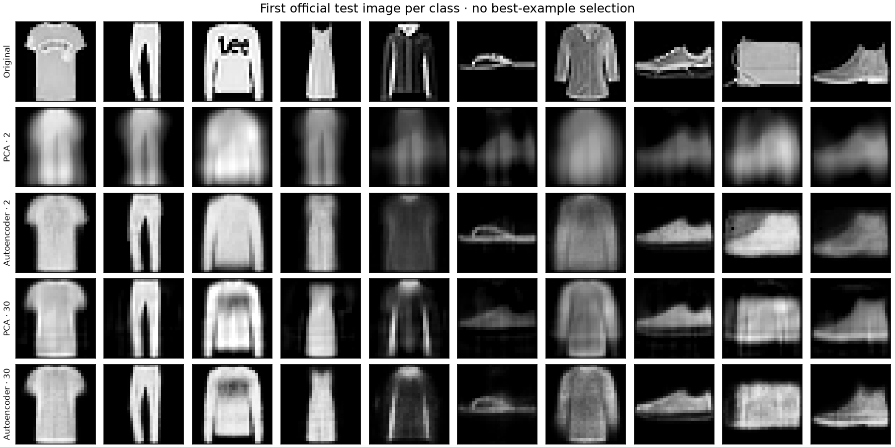
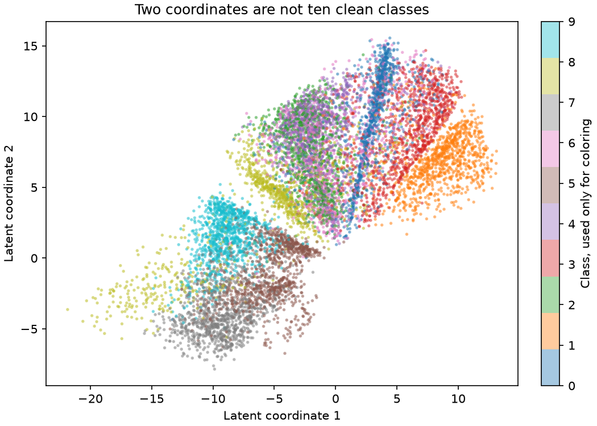

[← Machine learning](../README.md) · [Transfer learning](../transfer/README.md) · [Segmentation](../segmentation/README.md)

# Two numbers cannot keep every detail

The surviving **NN4science autoencoder assignment** used Fashion-MNIST, an encoder/decoder, mean squared reconstruction error, and bottlenecks of **2 and 30 coordinates**. It asked what the latent representation separates and what the decoder loses. The notebook includes convolutional models and experiments removing a decoder sigmoid.

This is a **new 2026 implementation**, with a smaller fully connected encoder/decoder and a sigmoid output. It revisits those questions on the original dataset; it does not reproduce the historical architecture, training run or course result. The modern code here was written by Codex under the owner's supervision.



The columns are the **first official test image of each class**, chosen by index before inspecting reconstructions. A 2-coordinate code captures broad shape but loses print, edges and other detail. Thirty coordinates preserve more, though the output is still a reconstruction rather than a lossless copy.

| Method | Coordinates | Test MSE ↓ |
| :-- | --: | --: |
| Training-set mean image | 0 | 0.08664 |
| PCA | 2 | 0.04564 |
| Autoencoder | 2 | **0.03054** |
| PCA | 30 | 0.01500 |
| Autoencoder | 30 | **0.01271** |

PCA is a useful **linear compression baseline with the same bottleneck dimension**. Its reconstructions are clipped to the known image range [0, 1], as are the autoencoder's sigmoid outputs. The nonlinear model has many more fitted parameters; equal bottleneck dimensions do not mean equal model complexity.

## Protocol

- **12,000 training / 2,000 validation / 10,000 official test images**. The training/validation subsets are class-balanced, seed 2026. Exact test-image matches and duplicate selected training images are excluded before fitting. [Exact indices](results/split.json).
- Inputs are divided by 255; class labels only balance the subsets and color the plot. Neither reconstruction method learns from class labels.
- Architecture: `784 → 256 → latent → 256 → 784`, ReLU hidden layers, sigmoid output; Adam, learning rate .001, batch 256, 30 epochs.
- Each dimension retains the lowest validation MSE checkpoint. PCA fits training images only. Both dimensions are frozen before the test is scored.
- MSE averages squared error over normalized pixels and then images. This is one training seed and one fixed split, not a broad benchmark or perceptual-quality score. Reported standard errors describe image-to-image error variation under an independence approximation; they do not measure training-seed uncertainty.



The 2D picture does not establish clean class separation. At 30 coordinates, **bags and sandals** have the largest class-average reconstruction errors in this run. Pixel error rewards broad intensity agreement and can favor blurry outputs. Exact deduplication does not remove all near-duplicate clothing images.

[Model](ae_model.py) · [Training](run.py) · [Metrics and per-class errors](results/metrics.json) · [Offline synthetic tests](../../../tests/test_ml_extensions.py)

## Run

```sh
python projects/machine-learning/autoencoder/run.py --cache /tmp/museum-ml-extensions --download
```

The first run downloads about 31 MB. The pinned dataset and checkpoints remain in the cache; figures, indices and metrics go in this chapter. No GPU is required. On the recorded machine this study took about five seconds after loading data; other environments can differ.

**Data credit:** Fashion-MNIST, Han Xiao, Kashif Rasul and Roland Vollgraf / Zalando Research, 2017. [Official dataset and paper](https://github.com/zalandoresearch/fashion-mnist/tree/b2617bb6d3ffa2e429640350f613e3291e10b141) · [MIT notice](FASHION-LICENSE.txt). The four downloads are pinned by SHA-256 in [the reader](fashion_data.py). Image examples and reconstructions derive from that dataset.

**Recorded run:** the saved metrics and figures come from the version before the readability refactor. Their original source hashes are preserved. See [run provenance and the scope of regression checks](../recorded-runs.md).
