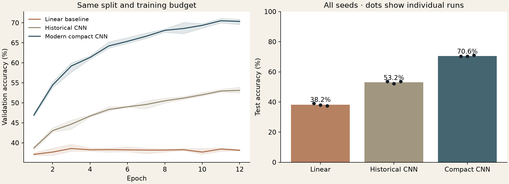
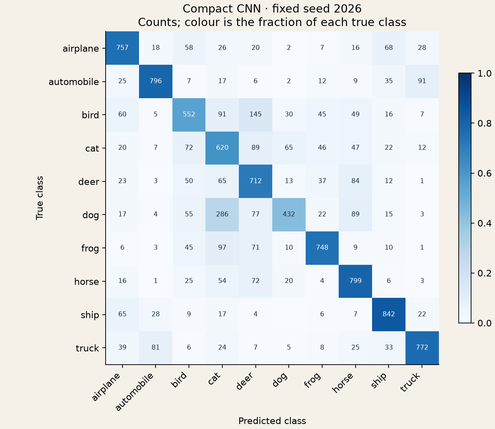
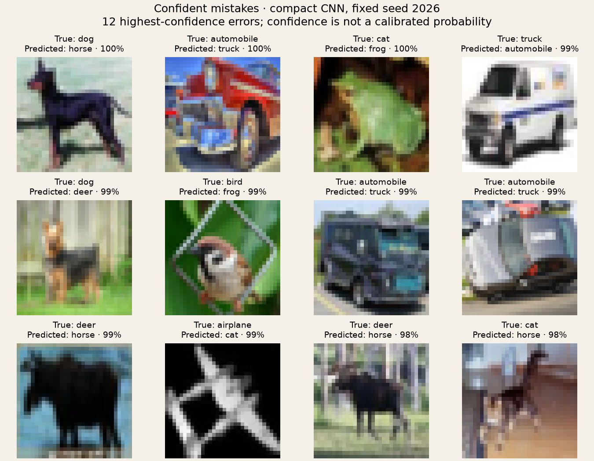

[← Learning from data](../README.md) · [My unchanged CNN](../../../originals/learning/convnet.py) · [Museum](../../../README.md)

# A small network, revisited

*The old convolutional network survives. Its evaluation gets a fresh start.*

My saved deep-learning coursework includes a complete `ConvNet` class for CIFAR-10. Its comments count the image dimensions after each convolution and pooling layer: 28, 14, 12, 6. The assignment prescribed the sequence of layer types; this is a surviving implementation of that assignment, not a claim that I invented the architecture.

The [historical cell](../../../originals/learning/convnet.py) is preserved exactly, including whitespace and comments. It came from cell 5 (zero-based) of `DL_msu_4_CIFAR_classification_CNN.ipynb`. The [originals manifest](../../../originals/manifest.json) records the full notebook and cell fingerprints. Its `nn` and `F` imports lived in an earlier notebook cell; the new runner supplies them without editing the exhibit.

## One protocol for three models

Codex built this 2026 experiment around three models:

| Model | What runs |
| :-- | :-- |
| Linear | A new softmax classifier on the flattened RGB pixels. |
| Historical CNN | The unchanged original class: two convolutions (3 and 5 channels), pooling, a 100-unit hidden layer. |
| Modern compact CNN | Three convolution blocks (16, 32, 64 channels), pooling, a 64-unit hidden layer. |

The historical architecture is **retrained now**. Its scores below are new measurements; they do not reconstruct an old notebook score. All models use the same normalized images, shuffled training examples, AdamW settings, 12 epochs and three seeds. There is no augmentation or pretrained network. The compact model also has more parameters, so this is a comparison of complete small models, not an isolated test of convolution or depth.

The official CIFAR-10 training partition is split into **45,000 training and 5,000 validation images**, with 500 validation examples per class. The **10,000 official test images** remain separate. Channel means and standard deviations are fitted on training images only. Each run selects its checkpoint by minimum validation NLL. All nine fits finish before the runner evaluates test performance. The protocol and split fingerprints are saved before training.

## Measured results

Test accuracy after validation-based checkpoint selection:

| Model | Parameters | Seed 2026 | Seed 2027 | Seed 2028 | Mean ± sample SD |
| :-- | --: | --: | --: | --: | --: |
| Linear | 30,730 | 39.05% | 38.07% | 37.53% | 38.22% ± 0.77 pp |
| Historical CNN | 19,478 | 53.62% | 52.27% | 53.58% | 53.16% ± 0.77 pp |
| Modern compact CNN | 89,834 | 70.30% | 70.34% | 71.09% | 70.58% ± 0.45 pp |

The unchanged old network learns substantially more than a linear pixel classifier. The new model gains about **17.4 percentage points** over it under this protocol, with about 4.6 times as many parameters. Four of the six CNN runs reached their best validation NLL in the final epoch and the other two one epoch earlier, so the gap describes this fixed 12-epoch budget, not training to convergence. These are current measurements of the saved architecture, not historical achievements.



Lines show mean validation accuracy; shading spans the three seeds. Dots show every test run. The [recorded protocol](results/protocol.json), [training log](results/training.json) and [full metrics](results/metrics.json) retain the split, environment, selected epochs and fingerprints. All nine saved checkpoints were reloaded and their test scores and predictions recomputed successfully.

## Inspect the mistakes

The confusion matrix uses the first configured seed (2026), chosen in advance. The image sheet shows that same model's 12 most confident errors, with ties broken by test index. These are deliberately difficult failures, not a representative random sample. Softmax confidence is not a calibrated probability of correctness. Per-seed confusion counts and image indices are retained in the error-analysis artifact.



Dogs are the weakest class in this run: 432 of 1,000 are classified correctly, while 286 are called cats. The overall score hides this uneven performance.



[Inspect all confusion counts and the selected image indices →](results/error-analysis.json)

## Reproduce and inspect

From the museum root, using its Python requirements:

```sh
python projects/machine-learning/cnn/run.py --cache /tmp/museum-cifar --download --output /tmp/cnn-run
python projects/machine-learning/cnn/verify.py --cache /tmp/museum-cifar --results /tmp/cnn-run
python -m unittest discover -s tests -p 'test_cnn.py' -v
```

The first command downloads approximately 162 MiB and runs on CPU. Use a fresh output directory for each experiment. The binary edition is parsed as fixed-size records, without loading pickle or extracting archive paths. The official MD5 and a recorded SHA-256 pin the data. Model weights and per-example predictions stay in the external cache; the repository holds the protocol, aggregate results and figures. The verification command reloads the saved weights, checks fingerprints and recomputes every test score and prediction.

Seeds and deterministic PyTorch operations make this run repeatable in its recorded environment. [PyTorch does not promise identical results across releases or platforms](https://docs.pytorch.org/docs/2.14/notes/randomness.html). The three-seed spread measures training variability on one fixed split; it is not a confidence interval for general performance.

## Data credit

CIFAR-10 was created by Alex Krizhevsky, Vinod Nair and Geoffrey Hinton. See the [official dataset and binary format](https://www.cs.toronto.edu/~kriz/cifar.html) and Alex Krizhevsky's 2009 report, *Learning Multiple Layers of Features from Tiny Images*. The small error gallery is derived from that dataset; these are not photographs or training data created by the museum's author. The full dataset is not committed here.
