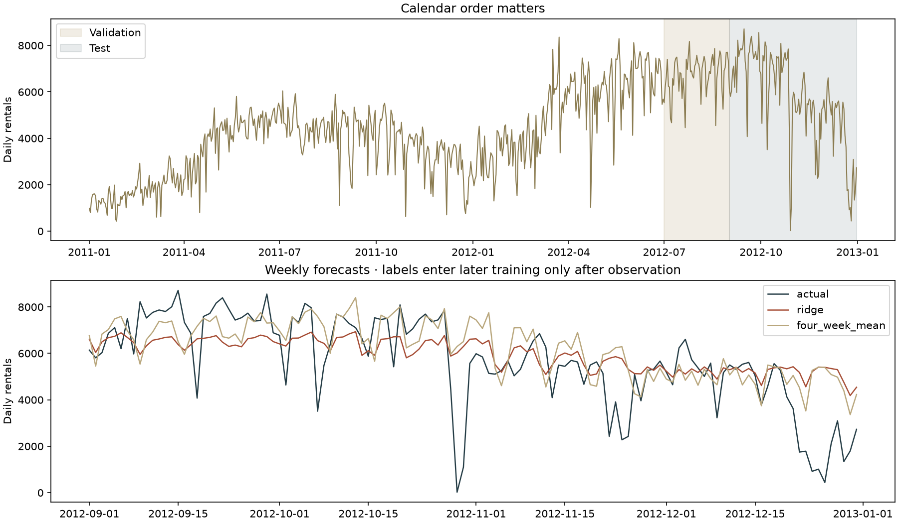

[← Machine learning](../README.md) · [Autoencoders](../autoencoder/README.md)

# A forecast must not know tomorrow

The **Practical ML final project** used **Delivery Club demand data**. The surviving notebook builds store/product lag features, adds calendar features and fits linear regression. It also records the realization that a row ID does not describe the object being predicted. The original `train.csv` is absent; an unlabeled test file and sample-submission template do not recover those targets. **The historical Delivery Club model and scores cannot currently be reproduced.**

This is a **separate, new 2026 experiment on different data**: daily **Capital Bikeshare rentals from UCI Bike Sharing**, 2011–2012. It preserves the methodological question—calendar features and lagged demand—without pretending that bike rentals are Delivery Club sales. There are no store/product groups in this substitute study. Modern code and prose are written by Codex under the owner's supervision.



## Predict the next week, then advance time

At each weekly forecast origin, fit on observations strictly before that day and predict the next **seven days**. Inputs are demand at lags **7, 14, 21 and 28**, weekday indicators, yearly sine/cosine and a calendar trend. Even the seventh day's lag-7 value is available at the origin. The code rejects horizons that would expose future demand.

Recorded future weather, `casual`, and `registered` counts are excluded: they would reveal information unavailable for a real advance forecast. Scaling is refitted inside each historical training window. Earlier evaluation observations enter later windows **only after their date has passed**, which is part of the declared online protocol, not a static one-shot test.

- Initial history: **1 January 2011–30 June 2012**.
- Validation: **July–August 2012, 62 days**. Select ridge alpha from .1, 1, 10, 100 and 1000 using rolling validation MAE; it selects .1.
- Test: **September–December 2012, 122 days**. Freeze the feature recipe and alpha, then repeat the weekly forecast schedule. Test performance does not select any setting.

| Predictor | Test MAE ↓ | Test RMSE ↓ |
| :-- | --: | --: |
| Same weekday last week | 1,325.5 | 1,896.1 |
| Mean of the previous four matching weekdays | **1,140.5** | 1,665.9 |
| Ridge regression with lags and calendar | 1,189.8 | **1,642.3** |

**The simpler four-week average wins on MAE.** Ridge beats last-week persistence and slightly improves RMSE, but does not win every useful comparison. MAE measures average absolute error; RMSE penalizes large misses more heavily.

A visible failure is **29 October 2012**: actual demand is **22**, while ridge predicts about **6,021**. Recent-demand and calendar features cannot anticipate every abrupt disruption. That explanation concerns the model's information; this experiment does not independently establish the cause of the observed drop.

[Forecasting code](forecast.py) · [Experiment](run.py) · [All dated predictions](results/predictions.json) · [Metrics by forecast horizon](results/metrics.json) · [Future-target mutation test](../../../tests/test_ml_extensions.py)

## Run

```sh
python projects/machine-learning/forecasting/run.py --cache /tmp/museum-ml-extensions --download
```

The **280 KB** source archive stays in the cache. This deterministic CPU experiment fits small linear models; no GPU is required.

**Data credit:** Hadi Fanaee-T, *Bike Sharing* (2013), UCI Machine Learning Repository, [DOI 10.24432/C5W894](https://doi.org/10.24432/C5W894), [CC BY 4.0](https://creativecommons.org/licenses/by/4.0/). The archive is pinned by SHA-256. Daily totals are analyzed and plotted here; this data credit does not cover the unrelated historical Delivery Club dataset.

**Recorded run:** the saved metrics and figures come from the version before the readability refactor. Their original source hashes are preserved. See [run provenance and the scope of regression checks](../recorded-runs.md).
