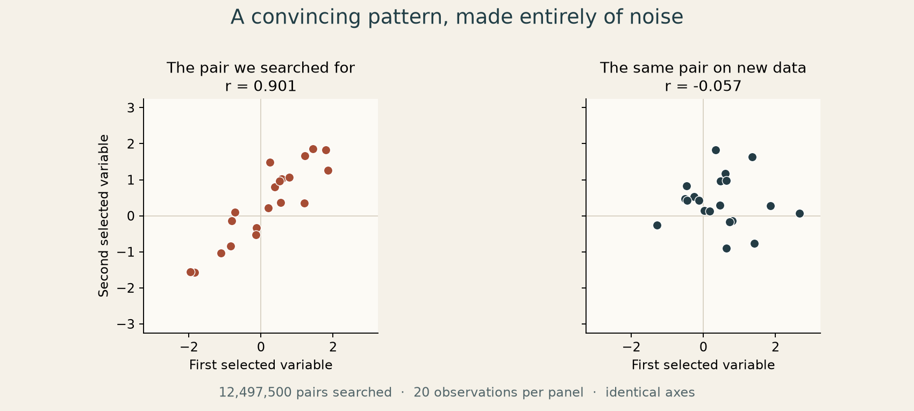

[← Learning from data](../README.md) · [Museum](../../../README.md) · [My original notebook cells](../../../originals/learning/random-correlations.ipynb)

# Patterns from pure noise

*Search long enough, and randomness starts to look like a discovery.*

**An experiment from my MSU.AI coursework.** In the feature-engineering notebook, I generated independent random data and went looking for a convincing relationship. This exercise stuck with me. Next to the first graph, I wrote:

> Фигасе, реааально сильно коррелированы!

*Whoa, they really are strongly correlated!*



## The discovery and the reveal

Generate **5,000 independent standard-normal variables**, with **40 observations** of each. Split the observations in half before looking for a relationship.

On the first 20 observations, search all **12,497,500 distinct pairs** and keep the pair with the largest positive Pearson correlation. Then freeze that choice and measure the **same pair** on the remaining 20 observations.

| Where we look | Correlation |
| :-- | --: |
| The half used to find the pair | **0.901** |
| The untouched half, with the pair already fixed | **−0.057** |
| The generating process: independent variables | **0** |

The picture on the left is real: those 20 points really do line up. What fails is the leap from that selected picture to a relationship that will persist. Nothing in the generator linked the two variables.

## The lesson

**The data that helped you find a pattern cannot also be its independent confirmation.**

We gave chance almost 12.5 million opportunities to produce something impressive, then displayed the winner. A large correlation for a pair chosen this way is not the same evidence as a large correlation for a pair specified before seeing the data.

Keep a genuinely untouched set of observations, freeze the choice, and check it there. If you keep changing the choice after each disappointing check, that set becomes part of the search too.

This example shows selection bias and why held-out checks matter. It does not mean every observed pattern is false, or that a fresh sample correlation must equal zero exactly. The reported numbers are one fixed run; the experiment deliberately searches for the largest **positive** correlation, not the largest absolute value. The many candidate pairs also overlap; they are not independent trials.

## The old code, beside the reconstruction

The [original notebook excerpt](../../../originals/learning/random-correlations.ipynb) keeps seven code cells, the quoted reaction and both saved plots. Cell text and outputs are unchanged. It retains the notebook's assumptions, including the earlier `numpy as np` import; it is a historical excerpt rather than a standalone notebook.

The [modern version](correlations.py) uses the same seed (**42**), random-number stream and 20/20 split. It finds the same pair, columns **1946 and 3734** with zero-based indexing, and reproduces the saved held-out correlation. It searches in blocks instead of keeping the full 5,000 × 5,000 correlation matrix. The new figure above uses scatter plots with identical axes to make the comparison direct. No real-world dataset or model training is needed.

[Recorded numbers and all 40 selected points](results/metrics.json) · [Runner and figure](run.py) · [Tests](../../../tests/test_random_correlations.py)

## Run it

From the museum root, with its Python dependencies installed:

```sh
python projects/machine-learning/random-correlations/run.py
python -m unittest discover -s tests -p test_random_correlations.py -v
```

The runner is offline. Its default writes this exhibit's metrics and figure; use `--output /tmp/museum-correlations` for a separate copy or `--seed 43` for another draw. A new seed changes the result, not the rule for selecting and checking the pair.

The tests compare the block search with an independent pair-by-pair Pearson calculation, cover ties and negative correlations, and change the held-out data to verify that it cannot change which pair was selected.
