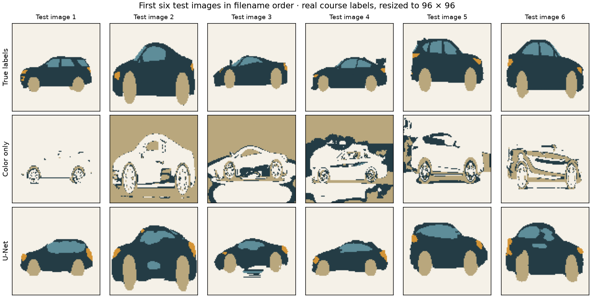
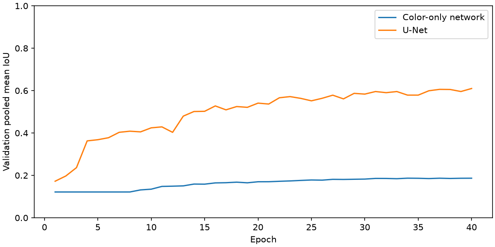

[← Machine learning](../README.md) · [Transfer learning](../transfer/README.md) · [Autoencoders](../autoencoder/README.md)

# A car is more than its color

The **Introduction to Deep Learning segmentation assignment** asked for a U-Net-like model separating **background, car body, wheels, lights and windows**. The notebook contains encoder/decoder blocks, skip connections and a batch-normalization variant. Its target was validation IoU above a course threshold; that historical result is not claimed here.

The original teaching-data link still works. This **new 2026 implementation** trains a smaller U-Net on its **211 genuinely annotated images**. The labels are provided by the dataset; they are **not synthetic masks or thresholded input pixels**. The model, splitting and experiment code here were newly written by Codex under the owner's supervision.



The rows show provided labels, a color-only neural classifier, and U-Net. Colors mean background (cream), body (dark), wheels (sand), lights (orange), windows (blue). These are the first six test images in filename order, not selected successes. Source photographs stay in the external cache.

| Model | Test mean IoU ↑ |
| :-- | --: |
| Always predict the most common training class | 0.131 |
| Color-only network, 1 × 1 convolutions | 0.158 |
| Small U-Net with spatial context and skip connections | **0.639** |

The color-only model receives RGB but cannot inspect neighboring pixels. Its failure illustrates why car parts require shape and context. Both learned models use the same split, training-only class weights, augmentations and validation checkpoint rule.

## Splitting is part of the experiment

A large set of files shares one capture date. Other filenames form numbered series. Splitting these images independently could put related views on both sides of the evaluation. Before training, the reader groups **capture-day filenames, numbered filename series, and exact decoded RGB duplicates**. It then allocates whole groups toward 70/15/15 proportions, largest groups first.

The resulting split is **147 training / 32 validation / 32 test images**. It is fixed by seed 2026. [Every source hash and group assignment](results/split.json). The groups are uneven: one capture day supplies 113 of the training images and one numbered series 23 of the validation images, while 25 test images are individually named files outside every series. Checkpoint selection therefore leans on one series, and no test image comes from the dominant capture day. Filename groups are conservative proxies: true scene/vehicle IDs are unavailable, near-duplicates may remain, and 32 test images make this a small demonstration. The grouped split is not a claim of complete scene independence.

Images resize to **96 × 96** with bilinear interpolation; masks use **nearest-neighbor**, preserving integer class IDs. A two-level U-Net uses channels 8/16/32 and GroupNorm. Adam trains for 40 epochs at .002, batch 8. Horizontal flips transform each training image and its mask together. Inverse-square-root-frequency class weights are fitted on training masks only. The color-only baseline follows the same schedule.

The best checkpoint maximizes **pooled validation mean IoU**. We sum the pixel confusion matrices first, then compute each class's intersection/union and average across classes with nonzero union. This avoids changing the metric by changing batch sizes. The test is scored after both checkpoints are frozen. U-Net's best validation score came in its final epoch, 40, so a longer schedule might still help; the color-only network peaked at epoch 34.



U-Net test IoU by class: **background .931, body .736, wheels .813, lights .213, windows .502**. Small lights remain the weakest part; aggressive downsampling and few examples limit detail. A favorable overall number does not mean every part is reliable. These modern numbers are not a historical grade.

[Model and metric](segment_model.py) · [Data and grouping](car_data.py) · [Training](run.py) · [Metrics and per-image errors](results/metrics.json) · [Offline tests](../../../tests/test_ml_extensions.py)

## Run

```sh
python projects/machine-learning/segmentation/run.py --cache /tmp/museum-ml-extensions --download
```

The first run downloads the **463,174,392-byte course archive**; it stays in the external cache with model checkpoints. The reader checks SHA-256 and reads only paired PNG members without extracting the archive. Training both models and scoring the test took about 65 seconds on the recorded CPU, after image preparation.

**Data provenance:** [the original assignment's public car-segmentation link](https://disk.yandex.com/d/plvsPQhbb1vvEw), archive SHA-256 `c73ff64ab732b28e9aaad4ec185df238221572b30291a739b2e59dfd67b6ca66`. This is a recovered teaching dataset, not a dataset collected by the collection's owner. No general redistribution license for its source photographs has been established; the archive and photographs are not vendored here. The displayed label-map comparisons derive from its supplied annotations.

**Recorded run:** the saved metrics and figures come from the version before the readability refactor. Their original source hashes are preserved. See [run provenance and the scope of regression checks](../recorded-runs.md).
