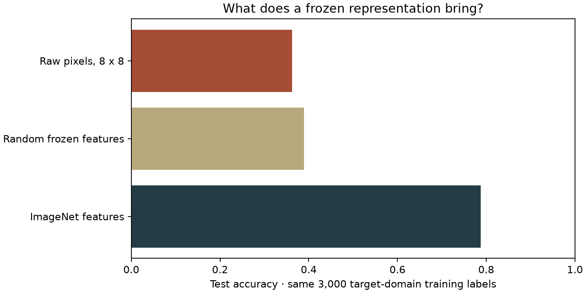
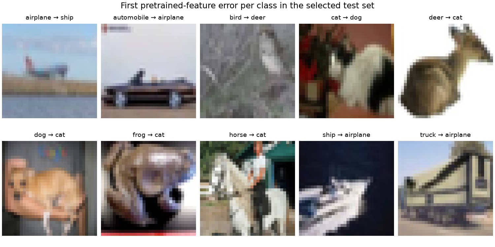

[← Machine learning](../README.md) · [Autoencoders](../autoencoder/README.md) · [Segmentation](../segmentation/README.md)

# What does an already trained eye bring?

The **Introduction to Deep Learning transfer-learning assignment** classified **42 Simpsons characters**. The surviving notebook replaces a pretrained ResNet's final layer and freezes the earlier parameters. Its course submission labels and historical result are not reconstructed here.

This **new 2026 study** tests the same frozen-representation idea on a small **CIFAR-10** label budget. It uses ImageNet-pretrained SqueezeNet 1.1, not the historical ResNet/Simpsons dataset. A fitted linear ridge classifier learns the new ten-class task; the convolutional network remains frozen and in evaluation mode. This modern code is written by Codex under the owner's supervision.



| Representation, followed by a fitted ridge classifier | Test accuracy |
| :-- | --: |
| ImageNet-pretrained SqueezeNet features | **78.80%** |
| Same architecture, randomly initialized and frozen | 38.90% |
| RGB pixels averaged to 8 × 8 | 36.25% |

The random-feature control keeps the architecture and feature dimension fixed. The pixel control asks whether the result needs that representation at all. These are **not** comparisons against training an entire CNN from scratch. ImageNet supplies substantial additional labeled data, so the table compares equal *target-task* label budgets, not equal total training data or compute.

## Protocol

**3,000 training / 1,000 validation / 2,000 test images**, equally represented classes. Train/validation subsets come from the existing CIFAR chapter's seed-2019 split; seed 2026 selects fixed class-balanced subsets. Test indices refer to the separate official test partition. [All indices](results/split.json).

Both frozen networks use the pretrained weights' documented preprocessing: bilinear resize to 256, central 224 crop, ImageNet channel normalization. Their spatially averaged final features have **512 dimensions**. The architecture has **722,496 feature parameters**. No dropout or mutable batch-normalization state enters the feature graph.

Each ridge pipeline fits its feature scaler on training vectors only. Validation selects alpha from **.1, 1, 10, 100**; the pipeline is not refit on validation. After every choice is frozen, the test is scored once. [Full metrics, choices and confusion matrices](results/metrics.json).



The figure uses the **first error per true class in test-index order**. The largest confusion is **dog → cat: 35 of 200 dogs**, followed by **bird → deer: 29 of 200 birds**. A frozen representation can be useful without resolving every small or ambiguous image. This single split/seed does not measure robustness across new datasets. Possible source-image overlap with ImageNet was not audited.

[Feature graph](squeeze_features.py) · [Experiment](run.py) · [Example indices](results/examples.json) · [Offline tests](../../../tests/test_ml_extensions.py)

## Run

```sh
python projects/machine-learning/transfer/run.py --cifar-cache /tmp/museum-cifar --cache /tmp/museum-ml-extensions --download
```

This reuses the [CIFAR reader](../cnn/cifar_data.py) and downloads the approximately **4.7 MB official pretrained weights** if absent. The dataset and weights stay outside Git. Feature extraction and fitting took about two minutes on the recorded CPU; this is an observation, not a runtime guarantee.

**Sources:** [CIFAR-10, Alex Krizhevsky](https://www.cs.toronto.edu/~kriz/cifar.html); [SqueezeNet 1.1 and ImageNet weights/preprocessing](https://docs.pytorch.org/vision/stable/models/generated/torchvision.models.squeezenet1_1.html). The small feature graph is adapted from torchvision; its [BSD notice](TORCHVISION-LICENSE.txt) is retained. Official weights are checked against the full SHA-256 recorded in the reader and metrics. These dependencies and pretrained features are not original code or achievements of the collection's owner.

**Recorded run:** the saved metrics and figures come from the version before the readability refactor. Their original source hashes are preserved. See [run provenance and the scope of regression checks](../recorded-runs.md).
