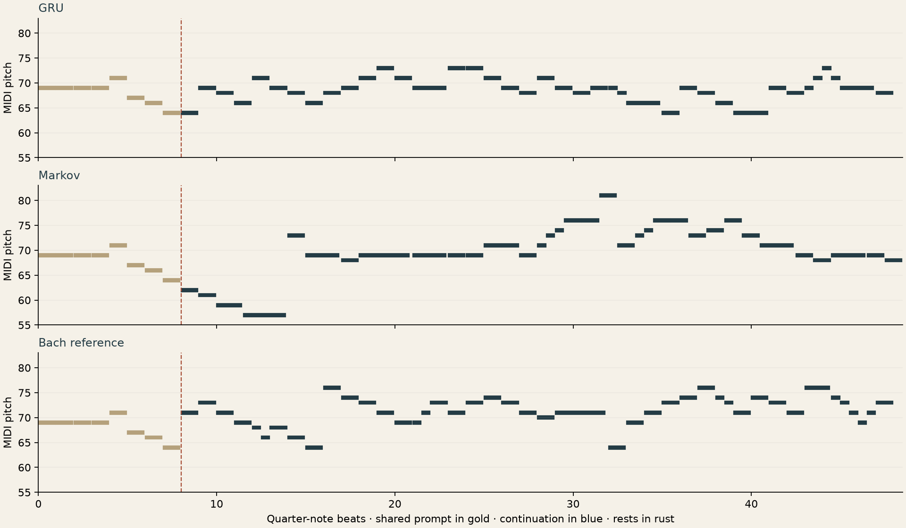
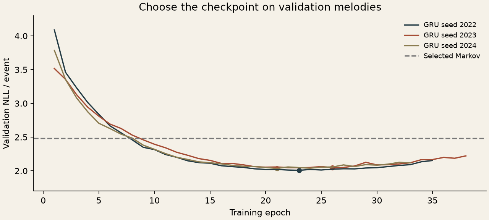

[← Collection](../../README.md) · [Previous: machine learning](../machine-learning/README.md) · [Next: algorithms →](../algorithms/README.md)

# 03 / A melody remembers

*Eight notes to begin. A recurrent model, a simpler rival, and Bach for comparison.*

**August 2022 · Krasnovidovo · MSU summer school.** Music generation was **our team's final project** on the neural-networks track of “Machine Learning, Neural Networks and Program Verification,” held **24–31 August 2022** at MSU's Krasnovidovo boarding house. We wanted a recurrent network to continue a melody in MIDI form. [School announcement](https://math.msu.ru/node/1837) · [School community](https://vk.com/mm_ml_school_2022).

The notebook survived, along with my note: “Нда, нужно было писать комменты тогда, зря торопился” — I should have written comments instead of rushing. The project below is a **new 2026 implementation developed with Codex** of that idea. These experiments and results belong to this reconstruction. [Then and now](history.md).

## Listen

Each row starts with the **same eight events from an unseen chorale**. The GRU and Markov models then continue independently; the reference follows Bach's score. All use the same soft synthesized instrument, tempo and original key. The examples last **27–29 seconds**.

| Prompt | GRU | Markov | Bach reference | Notes |
| :-- | :-- | :-- | :-- | :-- |
| 002 · *Ich dank dir, lieber Herre* · A major | [Listen](results/chor002-gru.mp3) · [MIDI](results/chor002-gru.mid) | [Listen](results/chor002-markov.mp3) · [MIDI](results/chor002-markov.mid) | [Listen](results/chor002-reference.mp3) · [MIDI](results/chor002-reference.mid) | [Compare](results/chor002-comparison.png) |
| 016 · *Es woll' uns Gott genädig sein* · B minor | [Listen](results/chor016-gru.mp3) · [MIDI](results/chor016-gru.mid) | [Listen](results/chor016-markov.mp3) · [MIDI](results/chor016-markov.mid) | [Listen](results/chor016-reference.mp3) · [MIDI](results/chor016-reference.mid) | [Compare](results/chor016-comparison.png) |
| 020 · *Ein feste Burg ist unser Gott* · D major | [Listen](results/chor020-gru.mp3) · [MIDI](results/chor020-gru.mid) | [Listen](results/chor020-markov.mp3) · [MIDI](results/chor020-markov.mid) | [Listen](results/chor020-reference.mp3) · [MIDI](results/chor020-reference.mid) | [Compare](results/chor020-comparison.png) |



These are the **first three test pieces in source numbering**, with fixed sampling seeds 11, 29 and 47. There was no search for the nicest sounding take. Gold marks the prompt; the dashed line marks where continuation begins. [Exact events and sampling settings](results/demos.json).

Both generators use temperature 0.85, but apply it differently: the GRU tempers pitch and then duration conditional on pitch; Markov tempers the joint pitch-duration distribution. These are listening examples with shared prompts and rendering, not a controlled comparison of sampling methods. The NLL scores below use the original, untempered probabilities and are unaffected by this difference.

## What the model learns

The corpus is the soprano line of Craig Stuart Sapp's digital edition of Bach's chorales. The source archive is pinned to a commit and SHA-256. Of its 370 scores, **310** fit this study's declared representation: a stable major/minor key and meter, monophonic events on a sixteenth-note grid, durations up to eight quarter notes, and enough notes for continuation. The 60 exclusions and their reasons are [listed individually](results/split.json). Modal key annotations are among the unsupported cases; notes are never silently rounded or truncated.

Tied notes are merged; repeated attacks and rests remain separate events. Repeats are read as written, without expanding repeat signs. Pieces are transposed to C major or A minor for modeling, then restored to their original key for listening. Dynamics, fermata lengthening, accompaniment and expressive timing are outside this experiment.

**230 training / 40 validation / 40 test pieces**, in **125 / 21 / 21 hymn families**. Grouping joins shared normalized titles, identical BWV identifiers, matching 16-interval openings, and interval sequences with similarity at least 0.72. Whole connected groups stay together before any training batches are formed. The rule is a conservative heuristic, not a complete musicological classification. Source hashes, group membership and every matching edge are recorded in the split manifest.

The **193,622-parameter PyTorch GRU** has two layers and predicts pitch (including a rest) followed by duration conditional on that pitch. Its input also includes mode, meter and the next onset's position in the bar. Training and sampling both use the complete available prefix; the recurrent state is carried forward during generation.

The rival is an **interpolated Markov model of pitch-duration events**. Validation chooses its order and smoothing strength from nine configurations; it selects order 2, strength 20. Both models learn from the same training pieces and are scored on every event after the first eight, without padding or warm-up events entering the metric. The GRU's checkpoints and representative training seed are also chosen using validation only.

## What happened

Negative log-likelihood (NLL) measures how much probability a model assigns to the actual next **pitch-and-duration event**. Lower is better; the unit is natural-log nats per event.

| Model | Test NLL |
| :-- | --: |
| Markov, validation-selected | **2.416** |
| GRU, training seed 2022 | **2.023** |
| GRU, training seed 2023 | **2.072** |
| GRU, training seed 2024 | **2.058** |
| GRU, mean ± sample SD across runs | **2.051 ± 0.026** |

The test contains **1,784 scored events**. The validation-selected GRU (seed 2022, epoch 23) improves on Markov by **0.393 nats/event**. A paired bootstrap of whole test families gives a 95% interval of **−0.508 to −0.298** for GRU minus Markov. This is uncertainty over this small held-out set, not a claim about arbitrary music.



The model begins to overfit after roughly 20–25 epochs; early stopping retains the better checkpoint. Better next-event prediction does **not** establish better musical form or listener preference. These are short monophonic continuations, not finished compositions. No human listening score is claimed.

The generated suffixes' longest exact training matches are **6, 8 and 7 events** for the GRU; allowing one constant transposition gives **6, 8 and 8**. Bach's held-out reference suffixes also share motifs of up to eight events with training pieces. The [overlap audit](results/demos.json) reports locations, excludes the provided prompt, and requires identical rhythm. It checks direct copying, not all possible memorization or originality.

[Training and evaluation](run.py) · [Model and baseline](model.py) · [Corpus and splits](corpus.py) · [Audio, MIDI and overlap audit](render.py) · [Metrics](results/metrics.json) · [Tests](../../tests/test_music.py)

## Reproduce

From the repository root, with [Python dependencies](../../requirements.txt) installed:

```sh
python projects/music-generation/run.py --cache /tmp/museum-music
python -m unittest discover -s tests -p test_music.py -v
python projects/music-generation/verify_results.py
```

The first command downloads the **178 KiB pinned score archive**, trains three models on CPU, evaluates their frozen checkpoints, and creates MIDI, piano rolls and 24 kHz WAV audio. Scores, parsed data, checkpoints and WAV files stay in the external cache; WAVs are in `/tmp/museum-music/audio/`. Install **FFmpeg** for the compact MP3 copies used above. Without it, WAV/MIDI/plots still render; previous matching MP3s are removed and the manifest explicitly records their absence. The render manifest fingerprints the events, MIDI, WAV and any MP3 files. Verification checks the MIDI timeline and file fingerprints; decoding an MP3 is not an independent check that its notes match. On the recorded Apple Silicon environment, the three training loops took about **27 seconds total**; first-time score parsing is additional. Hardware and library versions can change timings and floating-point results.

To regenerate listening examples from existing checkpoints:

```sh
python projects/music-generation/render.py --cache /tmp/museum-music
```

The offline tests cover ties, repeated notes, rests, invalid rhythm, family separation, masking, causal recurrence, gradients, probability normalization, deterministic sampling, copy detection and MIDI/audio timing. They download no corpus and run no full training job.

## Score credit

J. S. Bach; digital edition **© 2009 Craig Stuart Sapp**, [bach-370-chorales](https://github.com/craigsapp/bach-370-chorales/tree/67ef0b59bf49d0b562e8dfc9b870f6f9d5287822), **CC BY-NC-SA 4.0**. [Original notice](CORPUS-LICENSE.txt) · [License terms](https://creativecommons.org/licenses/by-nc-sa/4.0/).

The score-derived demo events, MIDI, audio and piano rolls in this chapter are provided under the same CC BY-NC-SA 4.0 terms. Changes include extracting the soprano, transposition, synthesized performance and generated continuations. The full score corpus is fetched on demand. This credit concerns these musical materials; the collection's own code license is still undecided.

[← Back to the map](../../README.md) · [Continue to algorithms →](../algorithms/README.md)
