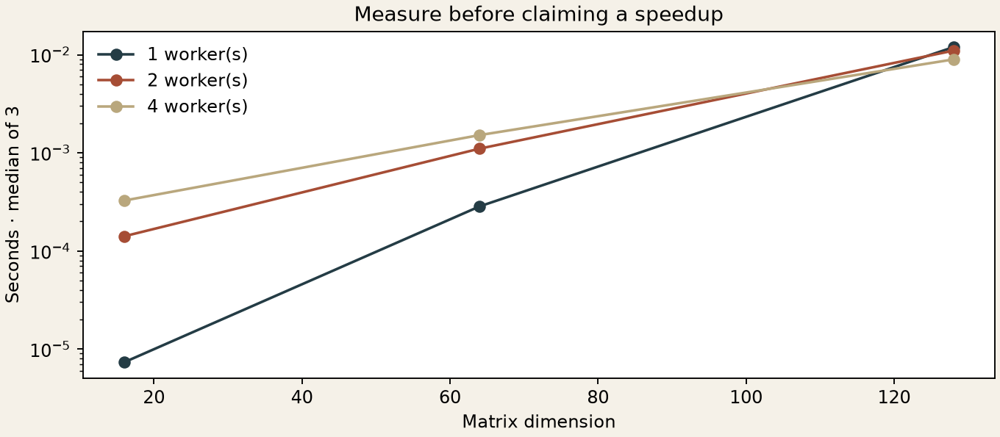

[← Collection](../../README.md) · [Origins](../../docs/origins.md) · [Next: machine learning →](../machine-learning/README.md)

# 01 / Making a matrix inverse trustworthy

*From a 2019 elimination exercise to checked serial, threaded and distributed C++ implementations.*

[Serial and threads](include/solver.hpp) · [MPI: one inverse, several processes](mpi/README.md) · [Selected original code](history.md)

**[Compare all three on identical matrices →](comparison/README.md)** The shared study measures the same checked-inverse task, including setup and diagnostics, and distinguishes MPI scaling from differences between implementations.



## The question

Can a handwritten Gauss–Jordan inverse be understandable, reproducible, and safe when several workers cooperate? The interesting part is not merely getting an inverse on a friendly matrix. It is handling a bad pivot without a deadlock, preserving the mathematical invariant, and checking the answer independently.

## Then

A Gaussian-elimination upload appears in the coursework archive on 22 November 2019. Its `matrix.h` matches the later version in the numerical archive after newline normalization. The later repository contains serial, pthreads, and MPI variants, with commits in January 2023.

This grew out of programming during my time at MSU’s Faculty of Mechanics and Mathematics. I still occasionally feel nostalgic about asking for help with MPI on Stack Overflow, and about the conversations that helped me understand how the processes cooperated.

The serial solver includes the comment **“первый шаг ручками”** — “do the first step by hand.” [Selected original lines](history.md) preserve that detail and their file fingerprint.

In the historical threaded version, a singular matrix could make one worker leave while others waited at a barrier. The reconstruction turns that failure into a timeout-protected regression case.

## Now

The new implementation keeps the original **column-operation** approach. If the product of elementary right-side operations is `E`, the invariant is

```text
transformed matrix = original matrix × E.
```

Once the transformed matrix is the identity, `E` is its inverse. Swapping columns is valid because the same operation is applied to both matrices.

At pivot step `k`, choose the largest remaining absolute entry in row `k`, swap its column into position, normalize that column, then eliminate every other entry in the pivot row. Only the nonpivot columns are updated concurrently. They do not write into one another or the read-only pivot column.

A fixed worker pool waits for operations issued by the main thread. Singularity is detected between completed operations; exceptions are collected and workers are joined through RAII. The new code uses C++17 `std::thread`, rather than copying the old pthread API.

[Matrix operations](include/matrix.hpp) · [Solver and worker pool](include/solver.hpp) · [Input reader](include/matrix_input.hpp) · [Command-line program](src/main.cpp)

## What was checked

- A column-swap case, zero and singular matrices, and invalid input, including a non-integer dimension; representable subnormal entries are accepted.
- 216 seeded diagonally dominant systems across 1, 2, and 4 workers, checking both left and right inverse residuals.
- Uniform scales of `1e-150` and `1e150`.
- Worker exception propagation and reuse, plus a subprocess deadline for deadlocks.
- **75 independent NumPy/LAPACK comparisons**; the largest entrywise difference was **4.44e-16**.

[Tests](tests/test_solver.cpp) · [CLI regression runner](../../scripts/run_cpp_tests.py) · [Oracle results](results/verification.json)

The benchmark measures the full inverse call, including worker startup and residual calculation, for sizes 16, 64, and 128, with three repeats. Small inputs are dominated by coordination costs. At size 128 the local sample shows an improvement, but this is not a general scaling result. [Raw CSV](results/benchmark.csv) makes the comparison inspectable.

## Run it

From the repository root:

```sh
make cpp-check
./build/inverse projects/numerical-methods/examples/pivot.txt 4
python scripts/numerical_experiment.py
```

The algorithm uses O(n³) arithmetic and O(n² + p) storage for matrix size `n` and worker count `p`. Data is row-major, while elimination traverses columns; this educational design trades cache efficiency for continuity with the original method.

The pivot threshold is relative to the largest input entry. It may reject an invertible but numerically unresolved matrix. Residuals are diagnostics, not a condition-number estimate. For solving a linear system in production, an explicit inverse is generally unnecessary. This chapter studies inversion itself.

## The MPI branch

The [restored MPI exhibit](mpi/README.md) distributes columns across separate processes. Each worker stores its own columns, chooses pivots collectively, exchanges columns when ownership differs, and broadcasts the normalized pivot. Expected failures reach every participant instead of stranding other processes in a collective.

The old MPI and pthreads applications are both **C++**, using C-style library interfaces. The original pthread barrier itself is C-compatible; the modern threaded version uses `std::thread`. The MPI page explains these distinctions, the ownership invariant, verification and measured communication costs.

```sh
make mpi-check
mpiexec -n 4 ./build/inverse-mpi projects/numerical-methods/examples/pivot.txt
```

MPI is an optional local dependency. The included MPI checks and results are from one host; no multi-node scaling claim is made.

[← Back to the map](../../README.md) · [Continue to machine learning →](../machine-learning/README.md)
