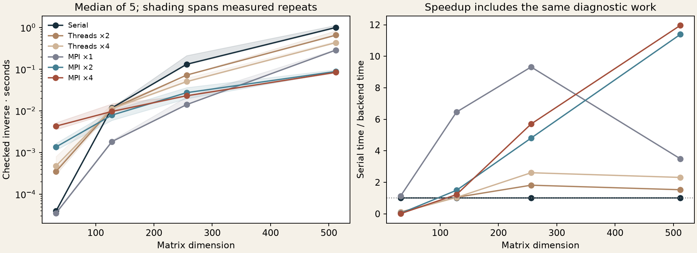

[← Numerical methods](../README.md) · [MPI](../mpi/README.md) · [Museum](../../../README.md)

# Same matrices, three execution paths

*How much of a speedup survives setup, communication and checking the answer?*

This 2026 study compares the existing serial, `std::thread` and MPI implementations. Every backend receives the same matrix bytes for a given dimension; the runner checks their fingerprints before combining the results. The old separate benchmark plots use different inputs and timing boundaries, so their curves should not be overlaid.



## What the clock includes

The clock starts with an input matrix ready in memory and ends with the inverse and its left residual available. It includes allocation, scaling, worker setup, column distribution, elimination, gathering and the same left-residual calculation and normalization. MPI also includes collective agreement about diagnostic errors. We take the slowest rank's elapsed time.

Matrix generation, process launch, `MPI_Init`/`MPI_Finalize` and an additional right-residual check are outside the clock. This describes a process already running, not the time to invoke `mpiexec` from a shell. The threads implementation creates and joins its workers inside each call. There is one warmup and five measured calls per configuration, with the configuration order shuffled using a fixed seed. Models were not training during the measurements.

## What happened on this machine

At **512 × 512**, the median checked-inverse times were:

| Implementation | Seconds | Relative to serial |
| :-- | --: | --: |
| Serial | 1.0103 | 1.00× |
| Threads ×2 | 0.6609 | 1.53× |
| Threads ×4 | 0.4374 | 2.31× |
| MPI ×1 | 0.2894 | 3.49× |
| MPI ×2 | 0.0887 | 11.39× |
| MPI ×4 | 0.0845 | 11.96× |

**11.96× is not the speedup from adding four processes.** The MPI implementation is already faster with one process. Its elimination loop uses contiguous local columns, whereas the serial/threaded implementation traverses a row-major matrix by columns. That is a plausible contributor; this experiment does not isolate its effect. The measured **MPI ×1 → MPI ×4 gain is 3.43×**. Two ranks are almost as fast as four here. The one-to-two-rank step alone is 3.26×, more than halving the work explains, so these ratios should not be read as parallel efficiency.

Small problems show the other side of the tradeoff. At 32 × 32, four threads take about 12× the serial time and four MPI processes about 110×. At 256 × 256, MPI with one process is faster than with two or four: communication dominates the saved work on this workload.

All **120 measurements** passed both left and right residual checks; the largest infinity-norm residual was **1.01 × 10⁻¹⁴**. These are residual checks on this strictly diagonally dominant matrix family. The separate [NumPy/LAPACK oracle study](../results/verification.json) and [MPI verification](../mpi/results/verification.json) cover more correctness cases.

This is one macOS arm64 host, Apple clang 17 and MPICH 5.0.2, without CPU affinity. Repeats show local variability; they do not establish general speedups, large-cluster performance or resilience to process failure. No solver was changed to improve this plot.

[Every measurement](results/measurements.csv) · [Environment, order and summaries](results/metrics.json) · [Shared input generator](common.hpp)

## Run again

With an MPI compiler and launcher available:

```sh
MPI_BUILD=/tmp/museum-mpi MPICXX=mpicxx MPIEXEC=mpiexec \
  python scripts/compare_parallel.py --output /tmp/museum-comparison
```

Use a fresh output directory. `--sizes 32 128` and `--repeats 3` give a shorter run. The two C++ drivers live here; the [Python runner](../../../scripts/compare_parallel.py) checks measurements and produces the figure. The serial/threaded and MPI solvers retain their existing correctness tests.
