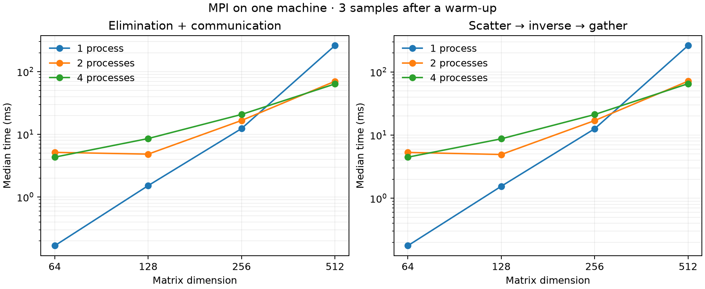

[← Numerical methods](../README.md) · [Historical fragment](../history.md) · [Implementation](solver.cpp) · [Tests](tests.cpp)

# One inverse, several processes

*The MPI branch of my old matrix project, rebuilt as a distributed C++17 program.*

The historical implementation already had the central idea: process `r` works on columns `r, r+p, r+2p, …`. This reconstruction keeps that idea and the same column-pivot Gauss–Jordan algorithm. It makes ownership explicit, stores only a process's own columns, and treats failure as something all participants must agree on.

## C, C++, MPI and pthreads

MPI is a message-passing interface, not a programming language. The old `Jordan_MPI` program is **C++**: its matrix type has constructors, `vector<vector<double>>`, references and overloaded operators. The functions named `MPI_*` use MPI's **C interface**, which is also callable from C++. The obsolete dedicated C++ MPI bindings are not used. [Open MPI's explanation](https://docs.open-mpi.org/en/main/building-apps/removed-mpi-constructs.html).

There is another historical parallel implementation: **`Jordan_threads` uses POSIX pthreads** inside a C++ program. Its small `synchronize.h` barrier is compatible with C and passed a C11 syntax check. The modern shared-memory chapter uses `std::thread`; that is a reconstruction choice, not a claim about the old implementation.

| Version | Memory and communication | Origin |
| :-- | :-- | :-- |
| Serial C++ | One matrix in one process | Historical coursework, rebuilt |
| C++ + pthreads | Threads share memory; custom mutex/condition-variable barrier | Historical implementation |
| C++ + MPI | Separate process memories; explicit message passing | Historical idea, restored here |
| C++ + `std::thread` | Fixed pool with exception propagation | Modern reconstruction of the threaded study |

## Follow one pivot

For four processes and ten columns:

```text
process 0: 0, 4, 8       process 1: 1, 5, 9
process 2: 2, 6          process 3: 3, 7
```

1. Rank 0 checks the input, scales it by its largest absolute entry, packs columns by owner and distributes them with `MPI_Scatterv`. Each process builds its own columns of the identity matrix.
2. At step `k`, each process finds its largest remaining candidate in row `k`. `MPI_Allreduce` with `MPI_MAXLOC` selects the global pivot; equal magnitudes choose the smallest column ID.
3. The owners exchange columns `k` and `pivot`, in both the working matrix and the evolving inverse. A local swap handles a shared owner; `MPI_Sendrecv_replace` handles different owners without a send/send deadlock.
4. The owner of column `k` normalizes it and broadcasts its two column vectors. Every process updates its own remaining columns. A collective check propagates non-finite arithmetic before the next step.
5. After the last pivot, processes undo the initial scale in their inverse columns. `MPI_Gatherv` collects the result on rank 0, which restores ordinary row-major output.

As in the serial implementation, elementary operations multiply on the right: **working matrix = scaled input × evolving inverse**. Distributed ownership changes where those operations happen, not this invariant. Column swaps affect both matrices; forgetting either swap would break it.

Processes with no columns still participate in the collectives. This matters when the process count exceeds the matrix dimension. The code also works with a supplied intracommunicator whose rank 0 is not world rank 0; split-communicator tests check this.

## Making failure finish

The old input path could return from rank 0 while other ranks waited for a broadcast. Here input, allocation and local arithmetic stages catch local exceptions, select the first failing rank, share a bounded diagnostic, and then throw on **every** rank. A singular pivot is observed by all ranks after the same reduction. Ordinary failures finalize MPI and return a nonzero exit status.

The tests check communicator reuse after expected failures, an error originating at a non-root worker, and an overflow that occurs only on the column-owning rank. The Python runner imposes deadlines and kills the entire local launch group if a regression hangs.

MPI communication/runtime failures use `MPI_Abort`; recovery from a crashed process, a broken connection or exhausted MPI resources is outside this study. This is not fault-tolerant distributed computing. A real out-of-memory condition may prevent MPI itself from progressing; a caught allocation exception is not a guarantee of recovery from system-wide resource exhaustion.

## Run it

Install an MPI implementation with its C++ compiler wrapper, such as MPICH or Open MPI. Then, from the repository root:

```sh
make build/inverse-mpi
mpiexec -n 4 ./build/inverse-mpi projects/numerical-methods/examples/pivot.txt
make mpi-check
make mpi-sanitize
python3 scripts/benchmark_mpi.py
```

The input is the dimension followed by `n*n` finite numbers; both programs share one [strict reader](../include/matrix_input.hpp), so a dimension such as `2.5` is rejected rather than read as 2. Only rank 0 reads the file and prints the inverse. A JSON diagnostic on stderr gives both inverse residuals and timings. Dimensions are limited to **1–4096**, keeping classic MPI counts and displacements within their integer range. Representable subnormal input is accepted; underflow to zero and overflow of the computed inverse are reported explicitly.

`mpi-check` needs NumPy; the benchmark additionally needs Matplotlib, both included in the root requirements. MPI is optional for the rest of the museum: `make check` remains the base suite, while `make mpi-check` must be requested explicitly and fails if MPI is missing. `MPICXX`, `MPIEXEC` and `MPIEXEC_FLAGS` select the compiler, launcher and platform-specific launcher options. For an Open MPI machine with fewer available slots than test processes, use `MPIEXEC_FLAGS=--oversubscribe`.

`MPI_BUILD` optionally puts executables in a different directory, including an absolute temporary path. Export the same value when running the Python check or benchmark directly. The [recorded MPI runtime configuration](results/runtime.json) identifies the source release and backend used for this edition.

The solver is collective and single-threaded within each rank. All members must call it in the same order and reserve the supplied communicator for this operation, including its point-to-point tag 0. Rank 0 alone provides the matrix pointer. The result contains the inverse only on that communicator's rank 0.

## Verification

The committed local run passed **510 C++ inversions** across 1, 2, 3, 4 and 6 processes, additional split-communicator checks, **75 independent NumPy/LAPACK comparisons**, and **45 failing CLI runs** that all terminated. Tests include column swaps across process owners, tied pivots, uneven ownership, more processes than columns, non-finite input, singular and numerically unresolved matrices, scaling by `1e-150` and `1e150`, representable subnormals, and inverse overflow. The C++ suite also passed UBSan at all five process counts. A later review added a non-integer dimension case, so the current check runs 48 failing CLI cases; its rerun reproduced all 75 recorded comparisons exactly, and the record was not regenerated.

Maximum relative entrywise difference from NumPy: **2.95 × 10⁻¹⁶**. Maximum residuals: **8.69 × 10⁻¹⁶** for `A·inverse−I`, **6.63 × 10⁻¹⁶** for `inverse·A−I`. [Full case-by-case record](results/verification.json).

The manual CI workflow now includes MPICH and Open MPI jobs. Those jobs have not been run on GitHub; the measured and sanitizer-checked implementation here is local MPICH. MPI itself was not rebuilt with UBSan. ASan/TSan success is not claimed.

## Local timing sample



The benchmark measures both elimination and the wider scatter/solve/gather pipeline. It computes elapsed time **within each process** and reduces those durations with `MPI_MAX`; it never subtracts timestamps from different processes. Matrix generation, MPI startup, file I/O, output and residual checks are outside the recorded intervals. Allocation, root packing and result reconstruction are included in the wider interval.

The committed sample uses **MPICH 5.0.2 with CH3 sockets**, on one macOS arm64 machine, without requested CPU affinity. This is a portable loopback/socket experiment, not a shared-memory-tuned MPI benchmark or a multi-node scaling result. Small matrices can be dominated by communication. More processes are not assumed to make the program faster. [Raw measurements](results/benchmark.json) · [CSV](results/benchmark.csv) · [Verification record](results/verification.json).

| Matrix | One MPI process | Two MPI processes | Four MPI processes |
| :-- | --: | --: | --: |
| 64 × 64 | 0.177 ms | 5.308 ms | 4.463 ms |
| 128 × 128 | 1.545 ms | 4.922 ms | 8.716 ms |
| 256 × 256 | 12.572 ms | 16.940 ms | 21.129 ms |
| 512 × 512 | 261.399 ms | 71.328 ms | 65.022 ms |

These are medians for the wider distributed interval, from three samples after a warm-up. At 512 × 512, four processes were about four times faster than one MPI process in this sample; on smaller inputs, one process won. This comparison uses the same MPI implementation at each process count, not the separate serial solver as its baseline.

For `n` columns and `p` processes, worker storage is **O(n·ceil(n/p) + n + p)**. Rank 0 additionally holds the input, packing buffers and gathered result, **O(n²)** storage. Arithmetic is **O(n³/p + n²)** with cyclic imbalance; each pivot uses a constant number of collective operations and broadcasts two length-`n` vectors. This is a teaching implementation, not a blocked BLAS/LAPACK or ScaLAPACK replacement.

The numerical threshold matches the serial study: `32·epsilon·n` after scaling. It can reject an invertible but numerically unresolved matrix. A small residual is useful evidence, not a condition-number estimate.

[← Back to the chapter](../README.md) · [Read the source →](solver.cpp)
