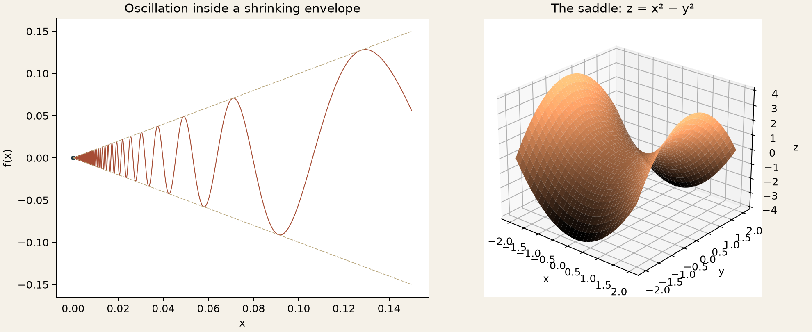
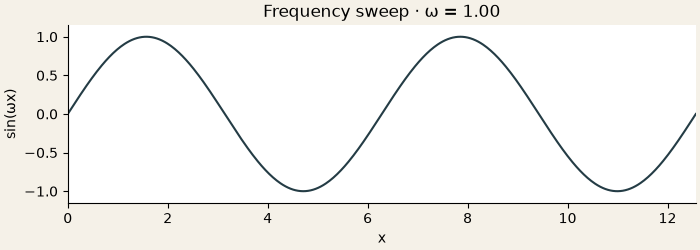

[← Collection](../../README.md) · [Previous: algorithms](../algorithms/README.md) · [Origins](../../docs/origins.md)

# 05 / Pictures of mathematics

*Portable versions of early plotting exercises.*

**2019 · Programming during my studies at MSU's Faculty of Mechanics and Mathematics.** These were exercises in turning mathematical formulas into pictures: a one-dimensional plot, a surface, an animation. Plotting uploads appear in the old repository in **May 2019**. [Historical map](../../docs/timeline.md).



## Then

The 2019 coursework archive includes one-dimensional plots, a saddle surface, and an animation exercise. The scripts depended on text files addressed by absolute Windows paths. Some mathematical construction was left in commented code.

[Selected mathematical lines](history.md) preserve those beginnings. The modern script computes its data directly and runs without that old laptop.

## Three views

**Oscillation.** The curve is `f(x) = x sin(1/x)` for positive x, with `f(0) = 0`. Its amplitude is bounded by ±x, so it approaches zero despite increasingly rapid oscillations. The displayed sample begins at x = 0.001; it does not resolve infinitely many oscillations near zero.

**A saddle.** The surface `z = x² − y²` has upward and downward parabolic sections. Equal-looking screen distances in a perspective plot should not be interpreted as equal 3D distances.

**Motion.** A smooth frequency sweep rebuilds the idea of the old animation with generated samples and a Pillow GIF writer. It is a new illustration, not an exact recovery of missing historical frames.



## Reproduce

```sh
python projects/visualizations/render.py
```

The [script](render.py) writes the static gallery and 40-frame animation. It uses a headless plotting backend, includes the origin explicitly in the first panel, and requires neither Windows data files nor FFmpeg.

[← Return to the collection](../../README.md)
